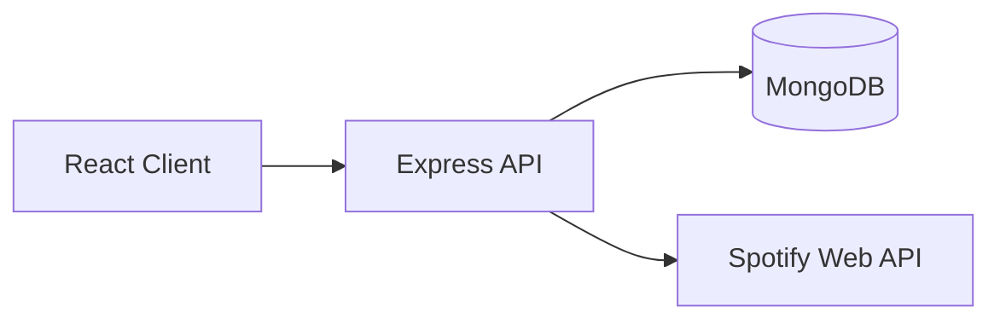

# Mood Music Intelligence Dashboard

A full-stack MERN web app that combines mood-based music discovery, a gamified quiz flow, playlist management, and analytics on user listening behavior.

This project was built as a fun BTech mini-project and demonstrates full-stack product thinking: UI/UX, authentication, external API integration, persistence, and analytics.

## 1) Tech Stack

### Frontend
- React (Vite)
- Tailwind CSS
- Axios
- Chart.js + react-chartjs-2

### Backend
- Node.js
- Express.js
- Mongoose

### Data / Auth
- MongoDB Atlas (or local MongoDB)
- Signup/Login using bcrypt
- Session identity stored as `userId` in browser localStorage
- No JWT

### External API
- Spotify Web API (Client Credentials flow for track search)

## 2) Current Feature Set

- Email/password authentication (signup + login)
- Quiz-first user flow with mood-based unlock
- Song discovery via mood and free-text search (song/artist)
- Liked songs library with edit/remove support
- Playlist CRUD inside app database
- Toast notifications and UI feedback
- Gamification elements (XP, level/progress, streak, badges)
- Mood analytics panel with counts + chart visualization
- Open liked songs on Spotify (direct link or fallback search)

## 3) Project Structure

```text
FSP-Project/
	client/                # React app
		src/
			App.jsx
			api.js
			index.css
	server/                # Express API
		src/
			index.js
			models/
			routes/
			services/
	README.md
```

## 4) Prerequisites

- Node.js 18+
- npm 9+
- MongoDB Atlas cluster (or local MongoDB)
- Spotify Developer app credentials

## 5) Environment Variables

### Server (`server/.env`)

```env
PORT=5000
MONGO_URI=mongodb://127.0.0.1:27017/mood-music-dashboard
CLIENT_ID=your_spotify_client_id
CLIENT_SECRET=your_spotify_client_secret
CLIENT_URL=http://localhost:5173
```

### Client (`client/.env`)

```env
VITE_API_URL=http://localhost:5000/api
```

## 6) Local Development Setup

### Step A: Install dependencies

```bash
cd server
npm install

cd ../client
npm install
```

### Step B: Run backend

```bash
cd server
npm run dev
```

Backend default URL: `http://localhost:5000`

### Step C: Run frontend

```bash
cd client
npm run dev
```

Frontend default URL: `http://localhost:5173`

## 7) Scripts

### Server
- `npm run dev` -> start with nodemon
- `npm start` -> start with node

### Client
- `npm run dev` -> Vite dev server
- `npm run build` -> production build
- `npm run preview` -> preview production build

## 8) High-Level Architecture



## 9) User Flow

1. User signs up/logs in.
2. App stores `userId` in localStorage.
3. User completes quiz to unlock discovery sections.
4. User searches songs or taps mood presets.
5. App logs mood, interactions, likes, and playlists.
6. Analytics and badges are generated from MongoDB data.

## 10) API Documentation

Base URL: `http://localhost:5000/api`

### Health

#### GET `/health`
Returns API status.

### Auth

#### POST `/auth/signup`
Create user account.

Request body:
```json
{
	"name": "Swikriti",
	"email": "you@example.com",
	"password": "Pass@12345"
}
```

Response:
```json
{
	"message": "Signup successful",
	"userId": "...",
	"name": "Swikriti",
	"email": "you@example.com"
}
```

#### POST `/auth/login`
Log in with email/password.

Request body:
```json
{
	"email": "you@example.com",
	"password": "Pass@12345"
}
```

### Music

#### GET `/music?query=<text>`
Fetches tracks from Spotify Search API.

Response:
```json
{
	"tracks": [
		{
			"songId": "...",
			"title": "...",
			"artist": "...",
			"image": "...",
			"spotifyUrl": "..."
		}
	]
}
```

### Mood

#### POST `/mood`
Stores mood selection history.

Request body:
```json
{
	"userId": "...",
	"mood": "happy"
}
```

### Song Interaction

#### POST `/song-interaction`
Create or upsert interaction by `userId + songId`.

Request body:
```json
{
	"userId": "...",
	"songId": "...",
	"title": "...",
	"artist": "...",
	"image": "...",
	"spotifyUrl": "...",
	"mood": "focus",
	"liked": true,
	"note": "late-night coding"
}
```

#### PUT `/song-interaction/:id`
Edit interaction metadata.

#### DELETE `/song-interaction/:id`
Delete interaction entry.

### Playlists

#### GET `/playlists?userId=<id>`
Fetch user playlists.

#### POST `/playlists`
Create playlist in app database.

#### PUT `/playlists/:id`
Update playlist metadata/songs.

#### DELETE `/playlists/:id`
Delete playlist.

### Analytics

#### GET `/analytics?userId=<id>`
Returns:
- `mostSelectedMood`
- `moodDistribution`
- `mostLikedArtist`
- `recentlyPlayed`
- `likedSongs`
- `badges`

## 11) Data Models

### User
- `name`
- `email` (unique)
- `password` (bcrypt hash)

### MoodHistory
- `userId`
- `mood`
- `timestamp`

### SongInteraction
- `userId`
- `songId`
- `title`
- `artist`
- `image`
- `spotifyUrl`
- `mood`
- `liked`
- `note`
- `timestamp`

### Playlist
- `userId`
- `name`
- `description`
- `mood`
- `songs[]` with song metadata

## 12) Notes on Spotify Integration

- Track discovery uses app-level Spotify Client Credentials token.
- This supports generic search, not account-personalized recommendations.
- Liked songs can open in Spotify using stored link or search fallback.

## 13) Troubleshooting

### MongoDB connection fails
- Check Atlas Network Access IP allowlist.
- Verify `MONGO_URI` username/password.
- If using strict network, test on hotspot/home network.

### Spotify search fails
- Verify `CLIENT_ID` and `CLIENT_SECRET` in `server/.env`.
- Restart backend after env changes.

### Frontend cannot call backend
- Check `VITE_API_URL` in `client/.env`.
- Ensure backend is running on the expected port.

### Build issues
- Remove `node_modules` and reinstall in `client` and `server`.

## 14) Known Limitations

- No JWT/session cookies (by design for this project scope).
- Playlist creation currently stores in app DB; not pushed as Spotify account playlists.
- Basic validation only; production hardening is out of scope.

## 15) Future Improvements

- Add Spotify Authorization Code flow for user-specific personalization.
- Push app playlists directly into Spotify account.
- Add chart filters (last 7 days, 30 days, all-time).
- Add automated tests (API + UI).

## 16) Credits

Designed and developed by Swikriti Mukherjee as a fun BTech mini-project.
